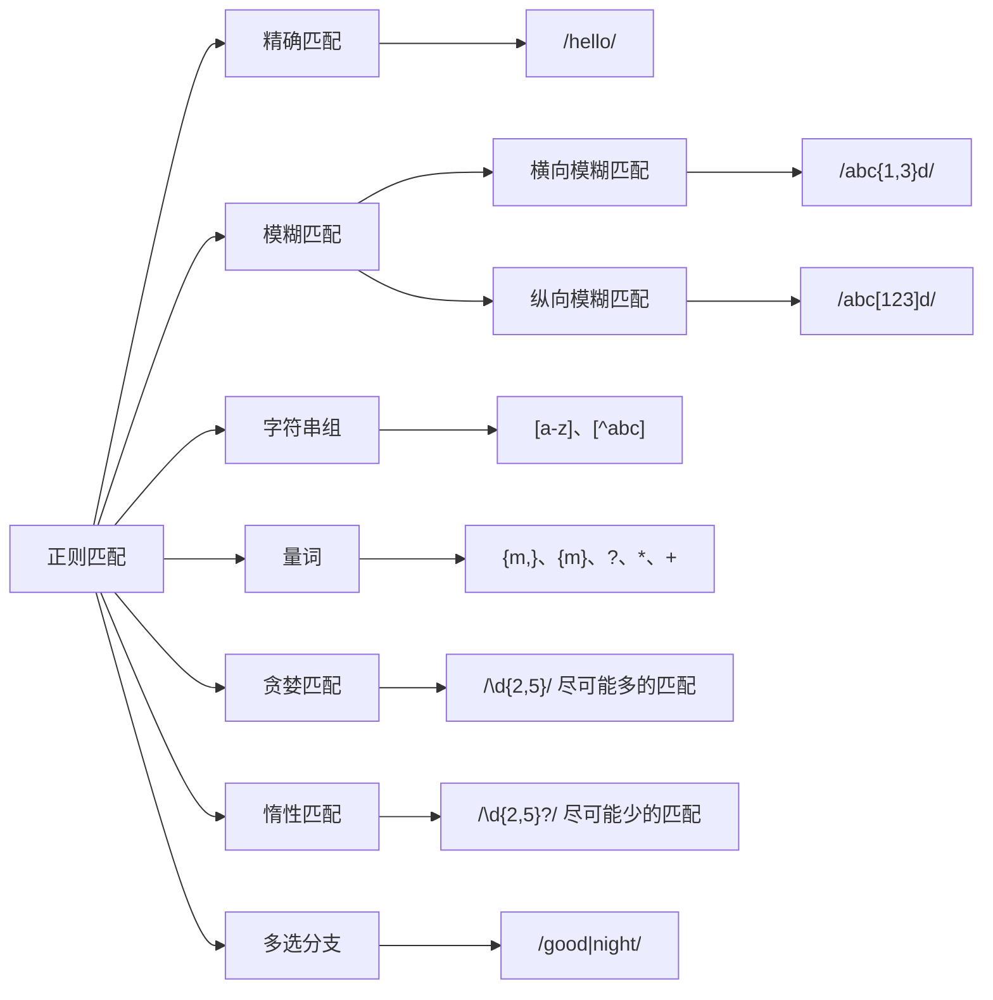

# 正则表达式（JavaScript）

---

## 第一章 正则匹配全解

### 本章知识结构图

- 精确匹配：简言之就是精确地匹配出模式字符串
- 模糊匹配：使用正则的规则，按照规则匹配出一系列的符合条件的字符串
- 横向模糊匹配：格式如 `/abc{1,5}d/`意为匹配`c`出现1~5次之间都可以
- 纵向模糊匹配：格式如`/abc[def]/`意为匹配中`abc`后边出现`d、e、f`任何之一就可以
- 字符组：形如`[abc]`意为匹配一个字符，为`abc`任意一个，用在纵向模糊匹配中

| 字符组                             | 含义                                            |
| ---------------------------------- | ----------------------------------------------- |
| \d                                 | `[0-9]`                                         |
| \D                                 | `[^0-9]`                                        |
| \s                                 | `[\t\v\n\r\f]`空白符                            |
| \S                                 | `[^\t\v\n\r\f]`                                 |
| \w                                 | `[0-9a-zA-Z]`                                   |
| \W                                 | `[^0-9a-zA-Z]`                                  |
| .                                  | 通配符`[^\n\r\u2028\u2029]`**几乎**表示任何字符 |
| `[\d\D]` `[\S\s]` `[\W\w] `  `[^]` | 表示任意字符                                    |

- 量词：形如`{1，5}`意为匹配的前一个字符出现1~5任意次数均可匹配

